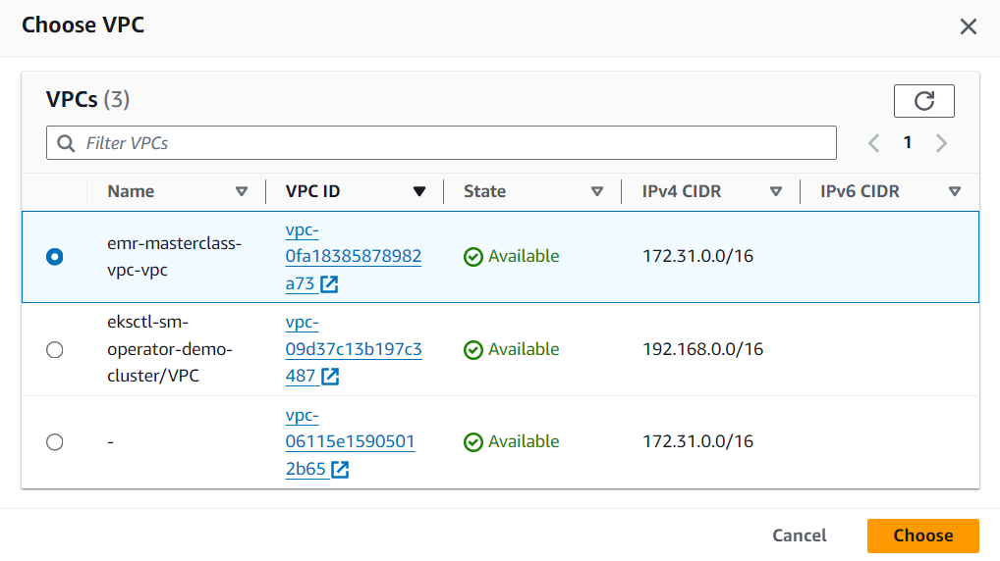

# AWS BigData Project

This project was developed in August 2024. My intention with this venture was to learn how to harness the robust compute capabilities of Amazon **Elastic Map Reduce (EMR)** and gain more knowledge in the field of Big Data and **Hadoop**. To integrate this, I opted for **Apache Spark** processing with AWS EMR. In other words, this project demonstrates the use of Amazon Elastic Map Reduce (EMR) for processing large datasets using Apache Spark. It includes a Spark script for **ETL (Extract, Transform, Load)** operations, AWS command line instructions for setting up and managing the EMR cluster, and a dataset for testing and demonstration purposes. To bring this project into life, I used S3 bucket and stored the input dataset, the code files and the output files and connected it to EMR. In addition, a Cloud9 shell environment to manage the services through CLI and a custom JAR *EMR Step* file was necessary to properly setup the service in accordance with the requirements of the system.

- Total number of records: **20000** (navigate to `s3-bucket/input/tripdata.csv`)


To start the system, you have two options:
1. Cloud9
2. EMR Step

## Connect via Cloud9

Amazon Web Services supports a special terminal environment called Cloud9. In essence it's a cloud shell and allows you to connect and manage your services through a command line interface. In this project, it is used to connect to a primary node of the EMR cluster using SSH, and in turn connect to the Spark job. To get started, follow the material provided below:


1) Open Cloud9 shell

2) Import the EC2 key-pair .pem file

3) Connect to primary node: ssh -i emr-masterclass-keypair.pem hadoop@ec2-51-20-251-32.eu-north-1.compute.amazonaws.com

4) Create .py file: nano spark-etl.py and add code in it


5) Submit spark job: spark-submit spark-etl.py s3://emr-masterclass-code-with-yu/input/tripdata.csv s3://emr-masterclass-code-with-yu/output/spark

6) Check the corresponding S3 bucket's content of /output

- Picture 3. notes: Selected EC2 instance master node and modified its corresponding IAM role permissions (attached S3FullAccess policy)

- spark-submit spark-etl.py [s3-input-folder] [s3-output-folder]


## AWS EMR Step

An alternative to using Cloud9 is to provide instructions for the EMR service through a *Step*. In this project I used a custom JAR that contains the instruction of submitting spark jobs. In the JAR file, you need to specify a spark submission command. Its name may very depending on your customized namings of the S3 bucket, data input file and EMR service, but the format is similar to this:

```
spark-submit s3://emr-masterclass-code-with-yu/files/spark-etl.py s3://emr-masterclass-code-with-yu/input/tripdata.csv s3://emr-masterclass-code-with-yu/output/spark-EMR-Step
```

*EMR Step Walkthrough:*


## Automated Bash Scripts

**Tests:** Since the main components of this project is monitored in Amazon Management Console, additional tests were not a necessity. I coded a Bash script in `/tests` that validates the connection and naming conventions of the content of a S3 bucket:


**Fetch Bucket:** In case the developer wants to view the content of the s3 bucket on his/her local computer, `fetch-s3-artifacts.sh` automates this process in one go, providing multiple options:


**Connect:** The procedure of connecting to the system is more complicated, since you need to setup instances on your Amazon Management Console and retrieve your own unique SSH keys to connect to the clients. To make this process as easy as possible for you, I present two files for you: `connect.sh` and `connect.txt`


## Development Process

*Create VPC for EMR instance:*


*Add Inbound Rules for the Security group of EC2-instance:*


*Create folders in S3 bucket and connect it:*


*Spark generated output:*


*AWS EMR custom JAR:*


*EMR Step Completed:*


*S3 Generated Artifacts:*
